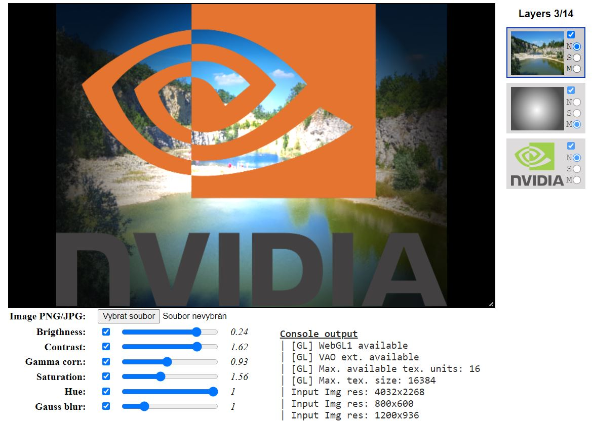

# ImgEdit
Simple GPU accelerated image editor (Work In Progress)
- Implemented using JavaScript ES6+ & WebGL 1.0
- Enables per-layer image (composition) adjustments and layer blending
- <a href='http://schillerpatrik.com/imgedit/' target='_blank'>http://schillerpatrik.com/imgedit/</a>

   

## Layers
- each layer can be separately adjusted
- layer blending modes: screen, normal, multiply

## Image adjustments
- contrast
- brightness
- gamma correction
- hue + saturation
- Gaussian blur (single pass 2D convolution)

## ToDo
- Image scaling (currently the scale (aspect ratio) is derived from the last image/layer loaded)
- Variable layers order (layers can be re-ordered by drag&drop in the layers panel)
- Better Gaussian blur methods - separable 2-pass & single pass aproximate GB
- Add new and more complex tools

## Known Bugs
- On older Android devices, alpha gradient for complete black doesn't work 
  - [0,0,0, 0.0] --> [0,0,0, 1.0] represented by data/masks/gradient_fullblack.png doesn't work
  - Fix: add some color to one of the channels, e.g. 1/255 to red channel, represented by data/masks/gradient_r1.png
